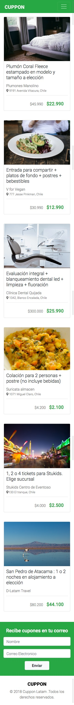

# Desafío - Cuppon
> Aplicando todos los conceptos y herramientas aprendidas en los videos sección Online
Mejorando la experiencia y diseño de los sitios web con Bootstrap, vamos a construir la
página de "Cuppon", guiándonos solamente por el mockup de la vista mobile.



## Requisitos

- Debes construir un layout responsivo, considerando Mobile First.
- Realizar la construcción del HTML y CSS siguiendo la maqueta proporcionada.
- Debes utilizar Bootstrap.

Tipografías:
- Roboto. 

font-weight:
- Roboto Light (300).
- Roboto Medium (500).

Colores:
- #212529
- #707070
- #F8F9FA o var(--light);
- #fff o var(--white);
- #28a745 o var(--success);

Íconos (Font Awesome):
- fa-map-marker-alt


```sh
/assets/img para las imágenes
/assets/css/style.css para el archivo CSS
/index.html
```

